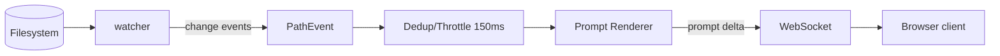

# fileflow — Architecture Review & v1.0 Target Design

> **Artifact type:** Architecture review + engineering spec
> **System:** `fileflow` — a CLI/web tool that turns a project file tree into a
> single deterministic LLM prompt.
> **Reviewer role:** Architecture Master
> **Version reviewed:** 0.2.0 (`a6a2d32` + `2f48b97`)

---

## 0. Classification

| Dimension | Value |
|---|---|
| Task type | **Review** (existing) + **Spec** (target v1.0) + **ADR** |
| Primary domain | `08-review-and-audit` · `01-framework-and-adr` |
| Secondary domains | `04-ai-and-agents` (LLM integration) · `06-integration-patterns` · `03-ui-ux-modern` |
| Africa context | Yes (Lagos) — matters for the optional backend + IDE-plugin story |

**System purpose:** Given one or more file/directory paths, collect every text
file (respecting hidden-file, `.gitignore`, and user ignore rules), then render
them as one parseable prompt in `default`, `xml`, or `json`, optionally trimmed
to a token budget.

**Current surface (measured, not guessed):**

| Component | Size | Role |
|---|---|---|
| `fileflow/cli.py` | 356 LOC | Python CLI (Click). Traversal, filtering, formats, `--max-tokens`. |
| `fileflow/web/js/core.js` | 210 LOC | Pure JS engine (port of CLI logic). |
| `fileflow/web/js/app.js` | 693 LOC | Browser UI (tree, editor, options, import, output). |
| `fileflow/web/js/core.test.js` / `smoke.test.js` | 176 LOC | Node unit + DOM-shim smoke tests. |
| `tests/test_files_to_prompt.py` | 29 tests, ~94% cov | Python pytest suite. |
| `web/` (html/css) | — | Static single-page client. |

**Constraints extracted:** solo-to-small-team AI-native tool; Apache-2.0; Python
3.8+ + Click; browser client must stay dependency-light; determinism is a core
value; files ideally never leave the user's machine.

---

## 1. Current-State Assessment

### 1.1 Logical view (what exists today)

```
                 ┌─────────────────────────────────────────────┐
                 │              GENERATION ENGINE              │
                 │  (rules: hidden · .gitignore · ignore-patterns│
                 │   render: default · xml · json               │
                 │   budget:  estimate_tokens · apply_token_budget)
                 └───────────────▲───────────────┬─────────────┘
                                 │ mirrors       │
                   ┌─────────────┴───┐       ┌───▼──────────────┐
                   │  CLI (Python)    │       │  WEB (JS core)   │
                   │  Click / stdlib  │       │  pure functions  │
                   └────────┬────────┘       └────────┬─────────┘
                            │ reads real FS          │ virtual tree in memory
                    real files on disk          browser import (drag-drop /
                                                 showDirectoryPicker)
```

### 1.2 What is strong

- **Pure-function core, separated from IO.** `iter_documents`/`generate_prompt`
  (Python) and `collectFiles`/`buildPrompt` (JS) are side-effect-free and unit
  tested. This is the right skeleton.
- **Determinism by construction.** Folders-then-files sorted walk, explicit
  separator format, no env/timing dependence.
- **Privacy-preserving default.** The web client is fully static — project
  contents never leave the browser. That is a *feature* and must be defended.
- **Progressive enhancement.** Import uses File System Access API with a
  `webkitdirectory` fallback; scroll animation has `@supports` fallback. Good
  forward/backward compatibility discipline.
- **Proportionate test gates.** Python at 94% coverage, Node unit + smoke tests.
  For a tool whose entire value is "deterministic, correct, parseable output,"
  the test discipline is the moat.

### 1.3 What is weak (the real findings)

**A1 — Logic drift risk between Python and JS (highest severity).**
The same rules — gitignore parsing, glob→regex translation, hidden-file rules,
token budgeting, all three formats — are *implemented twice*. They currently
agree (both test suites pass), but nothing *enforces* agreement. A fix to
gitignore semantics in one engine will silently diverge from the other. This is
the single most likely future defect class.

**A2 — Glob engine is a hand-rolled approximation.**
`globToRegExp`/`fnmatch` handles `*` and `?` only. Real `.gitignore` semantics
(negation `!pattern`, anchored paths `/foo`, double-star `**`, character
classes) are **not** implemented, and neither engine does directory-anchored
matching beyond the basename `dir/` case. The CLI claims "gitignore integration"
per the product spec — today it is a *subset* of gitignore, which will surprise
users and is a correctness gap.

**A3 — Token estimate is a constant heuristic.**
`~4 chars/token` is fine for a rough budget but is model-inaccurate (tokenizers
differ per model, and code tokenizes denser than prose). `--max-tokens` promises
"an approximate token budget" — the user contract is honest, but there is no
path to a real tokenizer today.

**A4 — The web client cannot see a "real" project.**
Import copies file *contents* into an in-memory virtual tree. Consequences:
(a) very large projects blow memory; (b) the browser can't resolve nested
`.gitignore` semantics against a real root; (c) "watch mode" is impossible
client-side; (d) an imported tree is a point-in-time snapshot, not a live
directory. This bounds the product at "scratchpad" and blocks the v1.0 roadmap
items (watch mode, real gitignore, large repos).

**A5 — No config file / profile persistence.**
Options (format, patterns, budget) reset on every load. The spec's `.files-to-prompt`
config support and "include/exclude file lists" are unbuilt. Users cannot encode
their standard prompt recipe.

**A6 — No output-size guard.**
A huge repo can produce a multi-MB prompt; generation is synchronous on the
main thread (`setTimeout`, but the render itself is blocking). Long files cause
the editor/render to jank. There is no paging, streaming, or async chunked
render at scale.

**A7 — CLI and web output can differ by a trailing newline / join nuance.**
`buildPrompt` joins blocks with `\n\n` and keeps trailing newlines; the CLI's
formatting has its own whitespace conventions. Cross-engine *byte-equality* is
not asserted. This breaks the "deterministic" promise across surfaces.

### 1.4 Severity-ranked risk register

| # | Risk | Likelihood | Impact | Mitigation |
|---|---|---|---|---|
| A1 | Engine logic drift (Py↔JS) | High | High | Single source of truth + cross-language contract tests |
| A2 | Incomplete gitignore semantics | Med | Med-High | Vendor a gitignore parser or specify supported subset explicitly |
| A4 | Browser cannot handle real/large projects | Med | Med | Optional local backend / watch mode |
| A7 | Cross-engine byte drift | Med | Low | Golden-output corpus test in both engines |
| A3 | Inaccurate token estimate | Med | Low | Pluggable tokenizer interface |
| A5 | No config/persistence | Med | Med | `.files-to-prompt` config file |
| A6 | Large-output jank | Low | Med | Async/streamed render + size guard |
| A8 | Server `root` escape → arbitrary file read (**occurred**) | High | **High** | ✅ Fixed — ADR-004; regression-tested over in-process, real-HTTP and WebSocket paths |
| A9 | Watcher missed changes (hidden/config files, sub-second edits) and leaked pollers (blocked `Ctrl+C`) | High | Med | ✅ Fixed — ADR-005 |
| A10 | `.files-to-prompt` misread/corrupted (pre-3.11 parser turned arrays into strings; unescaped writer) | Med | Med | ✅ Fixed — real fallback parser, strict mode, escaping writer; differential-tested against `tomllib` |
| A11 | DNS rebinding / unauthenticated `--allow-remote` | Low-Med | High | 🔴 **Open** — see backlog (Host allowlist, optional token) |

---

## 2. Decision Dimensions

| Axis | Assessment |
|---|---|
| **Scale** | Developer utility: sub-second single-project runs. 18-mo target: repos up to ~50k files, prompts up to ~1 MB. No multi-tenant SaaS. |
| **Team** | Solo → small (1–3). Python fluent; JS needed for web. |
| **Velocity** | Ship CLI + static web now; backend optional. |
| **Cost** | Near-zero infra (static hosting or local server). No third-party runtime. |
| **Risk** | Cost of being wrong is low (client-side, no data exfiltration, Apache-2.0). Migrations are cheap if the engine stays a pure module. |
| **Compliance** | None required; but "files never leave device" is a selling point to preserve. |
| **Africa-context** | If a backend exists, host options near Lagos (e.g., Africa-based region or self-host) to cut latency; keep the static client working fully offline for low-bandwidth. |

---

## 3. Target v1.0 Architecture

### 3.1 Principle: one engine, two thin surfaces

The correction for **A1/A7** is architectural, not cosmetic: **make the engine the
single source of truth and share it across both surfaces**, instead of two
hand-maintained ports.

```
                        ┌─────────────────────────────────────────┐
                        │          fileflow ENGINE (core)         │
                        │   pure, deterministic, side-effect-free  │
                        │   ┌───────────────────────────────────┐ │
                        │   │  rules: gitignore · hidden · glob │ │
                        │   │  select: include/exclude lists    │ │
                        │   │  render: default · xml · json     │ │
                        │   │  budget: tokenizer-agnostic        │ │
                        │   └───────────────────────────────────┘ │
                        └───────────▲───────────────┬────────────┘
                     loads──┐       │ shared        │ embedded
                  ┌─────────┴────┐  │               │   ┌───────────────────────┐
                  │  CLI (Click) │  │               └──►│  WEB client (static)  │
                  └──────┬───────┘  │   optional         └───────────┬───────────┘
                         │ real FS  │                              │
                ┌────────▼─────────▼─────────────────────────┐      │
                │        LOCAL SERVER MODE (optional)        │      │
                │   FastAPI · serves static web · FS access  │◄─────┘  /api/*
                │   watch mode · config file · large repos   │
                └────────────────────────────────────────────┘
```

### 3.2 The engine-sharing decision (ADR-001 summary)

Two viable strategies to kill **A1**:

- **Option A — WASM/Python-in-browser (Pyodide).** Compile the *Python* engine
  to run in the browser. One implementation, byte-identical everywhere.
  Trade-offs: large (~10–15 MB) initial payload, not dependency-light, fails the
  "web client must stay lightweight" constraint, overkill for a utility.
- **Option B — Spec-contract golden corpus + codegen.** Keep two implementations
  but pin them with a *shared golden-output corpus* (a committed fixture tree and
  the exact expected output per option combination), run identically in pytest
  and Node, and add a CI gate that fails if the engines diverge. Optionally add
  **property-based tests** (random trees) comparing both engines' outputs.
  Trade-offs: still two implementations, but divergence is caught mechanically;
  cheap, keeps the client static and light.

**Recommendation: Option B now, revisit A only if the client grows a backend.**
Option B is proportionate, zero new runtime deps, and converts A1 from "silent
drift" into "loud, testable drift." This is an ADR-worthy decision.

### 3.3 Fix gitignore semantics (A2) — scope honestly

Do **not** hand-roll a full gitignore parser. Either:

1. **Vendor/pin an existing parser** that is safe to embed (e.g., port of
   git's `wildmatch`, or a well-tested `gitignore-parser`), sharing behavior
   between Python and JS via the golden corpus; or
2. **Document a supported subset** (comments, blanks, `*`, `?`, trailing `/`
   for dirs, `!` negation, leading `/` anchoring) and add tests for *only* that
   subset, clearly labelled "not full gitignore."

Given the tool's honesty-first branding ("Deterministic output, no magic"), I
recommend **option 1 for `!` negation and `/` anchoring**, because users will hit
them immediately, and explicitly stating the supported subset otherwise.

### 3.4 Optional local server mode (A4) — a decision, not a default

A local FastAPI server (`fileflow serve`) unlocks the v1.0 roadmap — real
filesystem root, nested gitignore, watch mode, large repos, config file — while
keeping the *static* web client as the default, offline, zero-backend path.

| Capability | Static web (now) | `fileflow serve` (v1.0) |
|---|---|---|
| Real project root | ✗ (import snapshot) | ✓ |
| Watch mode / live reload | ✗ | ✓ |
| Nested `.gitignore` | partial | ✓ full |
| Config file `.files-to-prompt` | ✗ | ✓ |
| Very large repos | ✗ (memory) | ✓ streamed |
| Privacy (files never leave device) | ✓ | ✓ (localhost) |

The server binds to `127.0.0.1` by default (never `0.0.0.0` for untrusted use),
serves the same static `web/` build, and exposes a thin, read-mostly `/api`
(namespace below). Files still never leave the machine.

### 3.5 Config file + persistence (A5)

`.files-to-prompt` (TOML) precedence: **CLI flags > config file > defaults.**

```toml
[include]
patterns = ["src", "README.md"]     # include-list wins over dir-walk

[exclude]
patterns = ["*.min.js", "__pycache__"]

[output]
format = "default"                   # default | xml | json
separators = true
line_numbers = false
max_tokens = 8000

[ignore]
gitignore = true
hidden = false
```

Web client persists the same recipe to `localStorage` (key `fileflow-recipe`),
and can emit its `.files-to-prompt` equivalent for the CLI — completing the
web→CLI round trip the "CLI cmd" button already started.

---

## 4. Engineering Spec — `fileflow serve` (v1.0)

### 4.1 API design (integration map)

Base path: `/api`. All responses JSON. Read-mostly; no auth (localhost-only).
Pagination/streaming for large trees.

```
GET  /api/project                    → { root, name, fileCount, sizeBytes, mtime }
GET  /api/tree?root=<path>           → nested file-tree metadata (names, types,
                                       sizes), honouring .gitignore+ignore rules
GET  /api/prompt?format=&budget=&…   → the rendered prompt (+ meta: files, chars,
                                       ~tokens, lines, trimmed, dropped)
GET  /api/config                     → resolved .files-to-prompt (CLI+config merged)
PUT  /api/config                     → persist .files-to-prompt (guard-rail: localhost)
GET  /api/health                     → liveness/version
WS   /api/watch?root=<path>          → file-change events (add/modify/delete)
```

### 4.2 Backend module structure

```
fileflow/server/
├── __init__.py
├── app.py            # FastAPI app, static mount + /api router
├── deps.py           # localhost guard, path resolution
├── routes/
│   ├── project.py
│   ├── tree.py
│   ├── prompt.py
│   ├── config.py
│   └── watch.py      # watchdog → WS fan-out
└── serve.py          # `fileflow serve` entrypoint
```

### 4.3 Watch mode (event-driven integration)

Use the filesystem watcher as the event source; the WS endpoint is the sink.



Rules: coalesce bursts (a 150ms window), ignore `.git/`, respect the same
ignore rules as the walker, and push the *re-rendered prompt* (not raw events)
so the client stays stateless.

**As built (ADR-005):** the event source is a polled digest rather than OS
events, and the sink pushes a small notification rather than the rendered prompt;
the client re-fetches, which keeps the server stateless. Frames:
`{ready}` once after the baseline, then `{changed, config_changed, hash}`.
`config_changed` is derived from the *content* of `.files-to-prompt` so the client
re-reads its controls before refreshing. Bursts coalesce naturally because at
most one frame is sent per poll interval.

### 4.4 Scalability posture

- **Reasonable ceiling:** a single machine, watch on one repo, ≤ 1 prompt
  render/sec — trivially handled; no DB, no cache needed.
- **Guard rails added cheaply now:** (1) size cap on a single file read
  (e.g., 5 MB, configurable); (2) total tree cap with an explicit "too large,
  enable streaming" error; (3) render off the request thread (async or a small
  worker pool) so `serve` never blocks the watcher.
- **What we are explicitly NOT building:** multi-tenant hosting, auth,
  horizontal scaling, a message broker. Adding them would be YAGNI and would
  jeopardize the privacy story. Note this in the ADR as a conscious "non-goal."

### 4.5 Token counting (A3) — pluggable, honest

Keep `estimate_tokens` as the default (cheap, offline), but define an interface:

```
count_tokens(text, model="heuristic") -> int
```

Allow `--tokenizer tiktoken`/`--tokenizer model-name` to swap in a real
tokenizer when available, and label the meta line accordingly
(`~297 tokens (heuristic)` vs `312 tokens (tiktoken/cl100k)`). Never silently
mix estimators.

---

## 5. ADRs

### ADR-001 — Share the engine via a golden-output contract (not WASM)

- **Status:** Accepted
- **Context:** A1 — Python and JS engines can drift; byte-identical behavior is a
  product promise.
- **Decision:** Maintain both implementations but pin them with a shared,
  committed golden-output corpus; run the same fixture tree through pytest and
  Node and assert byte-equal output per option combination; add property-based
  cross-engine tests over random trees; gate CI on it.
- **Alternatives considered:** Pyodide/WASM (rejected: payload, deps, complexity,
  no backend today); single TypeScript engine compiled for CLI via Node (rejected:
  abandons the Python/Click CLI and Apache/PyPI distribution story).
- **Consequences:** +1 test surface; divergence becomes a loud CI failure;
  no runtime cost; keeps the static client light. Revisit if a backend makes a
  single runtime natural.

### ADR-002 — Static web client is the default; `fileflow serve` is opt-in

- **Status:** Proposed
- **Context:** A4/A6 — the browser alone cannot do real roots, watch mode, or
  large repos; but "files never leave the device" is a core value.
- **Decision:** Keep the fully static client as the default and the offline
  path. Add an optional local server bound to `127.0.0.1` for the v1.0 roadmap
  features. Never host a multi-tenant remote backend for user projects.
- **Consequences:** Two paths to test; watch/large-repo features gated behind
  `fileflow serve`; privacy story preserved; clear "not building a SaaS" boundary.

### ADR-003 — Scope gitignore support honestly

- **Status:** Proposed
- **Context:** A2 — hand-rolled globs under-approximate git semantics.
- **Decision:** Implement `!` negation and leading-`/` anchoring via a pinned,
  behavior-matched parser, cover them with corpus tests, and document any
  remaining unsupported constructs (e.g., `**`) in the README. Output never
  silently guesses.
- **Consequences:** Slightly more code + deps for correctness; user trust
  preserved (deterministic + documented).

### ADR-004 — The server is pinned to its root; clients may narrow, never widen

- **Status:** Accepted (security fix)
- **Context:** Every `/api` endpoint took a client-supplied `root` query parameter
  and trusted it; `--root` was only that parameter's *default*. A request such as
  `GET /api/file?root=/etc&path=hostname` returned files from anywhere the server
  process could read, and `--allow-remote` made that reachable from the network.
  The path guard (`safe_join`) only confined `path` to the *client-chosen* root, so
  it never engaged. The mitigation recorded in §6.3 was therefore incomplete. Found
  by probing a freshly started server, not by the existing tests (whose fixture
  relied on the very behaviour that was the bug).
- **Decision:** `build_app` fixes a jail: the realpath of `--root`. One dependency,
  `security.confine_root`, resolves every request's optional `root` and answers
  403 for anything outside the jail — after resolving symlinks, comparing on
  path-component boundaries (so `/srv/proj-evil` is not inside `/srv/proj`), and
  *before* any existence check (no oracle for probing the filesystem). The
  WebSocket applies the same check before the handshake completes. `/api/file`
  never serves anything under `.git/`. A relative `root` is relative to the jail,
  not the process CWD.
- **Consequences:** Clients can still scope to a sub-directory (monorepos).
  Regression tests cover each endpoint, the config write, the WebSocket, symlinks,
  sibling-prefix and NUL-byte inputs, over both the in-process client and a real
  subprocess; they were mutation-checked (re-introducing the old behaviour fails
  10 of them). **Not covered here:** authentication, DNS rebinding (Host header),
  and symlinks *inside* the project that point outside (the prompt walker follows
  file symlinks) — tracked in the backlog.

### ADR-005 — Watch protocol: polled digest, `ready` frame, `config_changed`

- **Status:** Accepted
- **Context:** The first watcher hashed every non-hidden file including
  `node_modules`; skipped hidden files (so `.files-to-prompt` and `.gitignore`
  edits were invisible, which made config-driven live refresh impossible);
  truncated mtimes to whole seconds (fast same-size edits were missed); sent the
  whole file listing as its "hash"; ran a blocking directory walk on the event
  loop; and, because it swallowed the client-disconnect signal, left a poller
  running forever for every closed tab — which also made `Ctrl+C` hang.
- **Decision:** Poll a digest of `path + size + mtime_ns` over every
  prompt-relevant file (hidden files included; gitignored paths and heavy
  directories pruned), off the event loop. Track `.files-to-prompt`'s *content*
  separately (even if the project ignores that file) so frames carry
  `config_changed`. Send a `ready` frame with the baseline digest so a
  reconnecting client can tell whether anything changed while it was away. A
  dedicated receiver task ends the watcher the moment the client leaves.
- **Alternatives:** OS events via `watchfiles`/`watchdog` — lower latency but an
  extra dependency and platform quirks; revisit if polling cost matters
  (`watchfiles` already ships with `uvicorn[standard]`). Pushing the re-rendered
  prompt (§4.3 target) — deferred; re-fetching keeps the server stateless.
- **Consequences:** Latency is bounded by the poll interval (the client uses
  1.5 s). Changes to gitignored files are not announced.

---

### ADR-006 — Task-bound workflow presets and instruction wrapping

- **Status:** Accepted — implemented in R1 (CLI; web surfaces in R3)
- **Context:** Users repeat the same bounded tasks ("one section at a time"). Retyping paths, flags and instructions is the main source of friction and of whole-project prompts that go wrong.
- **Decision:** Add named `[presets.<name>]` to `.files-to-prompt` (paths, instruction/instruction_file or structured prompt, `{{vars}}`, budget, filters). Add `--preset`, `--instruction`, `--instruction-file`, `--var`. Precedence: **CLI flags > preset > root config > defaults.** Instructions render outside the files section (`# Task` / `<task_instructions>` / `"instructions"`). Variable substitution is pure string replacement; unresolved placeholders are an error. State stays in plain files; no task database.
- **Alternatives:** shell aliases/scripts (rejected: not portable to web/IDE, no validation); a templating language (rejected: turns config into code, breaks determinism and parity); a separate `fileflow-tasks` tool (rejected: splits a one-step journey).
- **Consequences:** +config surface and +parity work (golden corpus first); presets become the unit that web and VS Code surfaces expose.

### ADR-007 — fileflow never calls an LLM; verification is deterministic

- **Status:** Accepted — receipt and secret guard implemented in R1. **Amended by ADR-010:** model calls now exist, but only as an opt-in, separate `ask` command. The *core* (`prompt`, `serve`, `check`, `fetch`, the receipt) still never calls a model and holds no keys; that part of this ADR stands.
- **Context:** Inputs such as analyzers and ATS-style tools blend generation and verification. A prompt packager that also generates would lose determinism, offline use, and the right to say "this is exactly what was packaged".
- **Decision:** fileflow holds no model credentials and makes no model calls. It produces a **Context Receipt** (included / excluded-with-reason / truncated / verified-assumed-unknown) computed from the same walk that builds the prompt. Reason codes are a closed enum. Estimates (tokens) are labelled as estimates.
- **Alternatives:** optional "summarise large files with an LLM" (rejected: non-deterministic, privacy-negative, parity-breaking); no receipt (rejected: silent omissions were already a verified bug class, e.g. nested `.gitignore`, symlinks).
- **Consequences:** Clear product boundary; every claim the tool makes is testable; users who want generation use their AI tool of choice downstream.

### ADR-008 — Fetched content is a local file with recorded provenance

- **Status:** Accepted — `fetch` and provenance labels implemented (R2); `fetch` and `ask` are the only two networked commands
- **Context:** Users want to bring web text into prompts (and AI-generated analyses already exist as files). Provenance is otherwise lost, and generated text gets mistaken for source material.
- **Decision:** `fileflow fetch <url>` is the **only** networked verb. It saves extracted text as markdown with front matter (`source_url`, `fetched_at`, `sha256_12`, `provenance: observed|generated|user`). The walker passes provenance to renderers/receipt. `fetch` is CLI-only, refuses private/loopback/link-local targets (re-checked on every redirect), has size/time caps, and is never exposed through `fileflow serve` (SSRF).
- **Alternatives:** live URL inputs inside `prompt` (rejected: network in the hot path, non-deterministic); a crawler (rejected: out of scope, see non-goals); browser-extension capture (parked).
- **Consequences:** Offline-by-default holds; provenance is explicit but is *origin*, not *truth*; extraction quality needs golden fixtures.

---

### ADR-009 — Harness tooling verifies and scaffolds; it never runs an agent

- **Status:** Accepted — `init`/`check` implemented
- **Context:** The "agent = model + harness" material describes eight components. Only some are repository-resident files (instructions, docs, skills, permissions settings); the rest (tools wiring, the loop itself) belong to the agent runtime. Vendor documentation states that permission *rules* are enforced by the tool, not the model — so a harness described only in prose is advisory.
- **Decision:** fileflow scaffolds the file-resident parts (`init --template harness`) and checks them mechanically (`check`). It distinguishes **advisory** from **enforced** in both the template and the check, cites the source of every threshold, reserves *errors* for things that definitely break, and states in every report what a structural check cannot know. It does not run agents, orchestrate reviewers, store memory, or manage MCP/tool wiring (ADR-007, alignment filter A1).
- **Alternatives:** a reviewer-agent runner (rejected: calls a model); a generic "AI readiness score" (rejected: false precision — the same failure the receipt exists to avoid); copying a commercial template (rejected: unavailable and unnecessary — built from public primary sources).
- **Consequences:** limits in the vendors' docs will drift, so they are configurable and sourced; the repository checks itself in CI (`fileflow check --strict`); effectiveness of a harness is **not** measured here and is not claimed.

---

### ADR-010 — Model calls: an opt-in, single-shot `ask` command, kept outside the deterministic core

- **Status:** Accepted (decided by the product owner after the options below were put to them)
- **Context:** ADR-007 said fileflow never calls a model. The owner asked for fileflow to run agents, review code, keep memory, call models and manage MCP tools. Doing all of that inside the core would end determinism, key-freedom and offline use, put an API key and an egress path inside the server, and — for agents that *act* — require real sandboxing (see `docs/research/harness-engineering.md`: prose rules are advisory, only enforcement is a fact).
- **Options considered:** (a) opt-in layer separate from the core; (b) reverse ADR-007 in the core; (c) defer and design first; (d) not intended. **Chosen: (a)**, with a first step of **single-shot only** (prompt in, answer out; no tools, no file writes, no shell), and **both** an OpenAI-compatible and an Anthropic adapter.
- **Decision:** `fileflow ask` builds the same bundle as `prompt` (one shared assembly function, so presets, include, diff, receipt and the secret guard all apply) and sends it to one endpoint. Safety rules, each tested: the destination and key come from the CLI or the user's environment, **never from `.files-to-prompt`**; https required except loopback; no embedded credentials; **redirects refused** (urllib re-sends headers, key included, on 301/302/303); consent before anything leaves the machine for a non-local host; secret guard defaults to **block** for non-local hosts and only the command line may relax it; the key is never printed and is scrubbed from errors; responses size-capped; the answer is saved only on request and labelled `provenance: generated`; the receipt gains a `model_call` record and keeps *correctness of the answer* under **unknown**. The module is imported only by the `ask` command — not by `prompt`, `serve`, `check` or `fetch` — and the server has no model endpoint (both asserted by tests).
- **Not built (and why):** *Agents with tools/shell/file writes* — need an enforced sandbox, not prose rules; *memory* — would be files the next session reads, deferred until single-shot is used for real; *MCP management* — tool wiring belongs to the agent runtime; *code review* — available now as `fileflow ask --preset review --diff --patch` (a single-shot call over the changed files and their patch), not as a separate reviewer agent; *retries/streaming* — a retry costs money and streaming adds surface; neither is needed to be useful.
- **Consequences:** fileflow now has a second networked command and handles an API key, so the threat model grew (see "What could go wrong" items 9–15). The adapters were written from documented formats and tested against mock servers only; **no live provider call has been made**. Phase 2 (read-only tools) and Phase 3 (sandboxed writes) each need their own ADR before any code.

---

## 5b. Production ADRs (011–024)

> Proposed in [`production-architecture.md`](production-architecture.md). Evidence tags and sources are there; most outside sources are secondary. Each ADR needs the owner's acceptance before work starts on its phase.

### ADR-011 — Product thesis: governed AI handoff for engineering teams

- **Status:** Proposed (not yet accepted by the product owner)
- **Context:** Packing is commodity (Repomix, code2prompt, gitingest, files-to-prompt; Repomix already has Secretlint and an MCP server). fileflow's distinct assets are deterministic parity, receipts, provenance, hardened edges and a harness check. Compliance pressure (NDPA 2023 / GAID 2025) makes proof of transfers valuable.
- **Decision:** Position fileflow as *context governance*: the way a team proves what it sent to an AI and keeps its AI-facing repo legible and safe. Beachhead: engineering teams (5–200) at fintechs/agencies/vendors, starting in Nigeria/West Africa. Use cases ranked UC1 safe AI handoff, UC2 AI-ready repo gate, UC3 reviewable AI change; the solo "one section at a time" workflow is the free on-ramp, not the business.
- **Alternatives considered:** "Better prompt packer for individuals" (commodity, hard to monetise); a general AI coding assistant (not our strength, crowded); governed knowledge packs for non-code teams first (large market, wrong first journey).
- **Consequences:** Roadmap emphasises receipts, policy and the CI gate before any hosted component. Marketing makes no compliance claim without counsel review.
- **Revisit when:** after 5–8 pilots no team values the receipt/policy enough to pay or to keep the gate on (then fall back to a developer tool + services).

### ADR-012 — Staged architecture; repo-resident first, hosted last

- **Status:** Proposed (not yet accepted by the product owner)
- **Context:** A server is the costliest thing to be wrong about, and the product's trust story is local-first.
- **Decision:** Four stages: S0 local core (built) → S1 repo-resident policy + signed receipts + CI action + read-only MCP server → S2 team plane (policy distribution, audit store, SSO, gateway) → S3 knowledge plane (governed retrieval, read-only agent tools). A stage starts only when the previous one is used by real people and has produced evidence (Gate E).
- **Alternatives considered:** Build the hosted team plane first (faster to demo, slower to learn); a SaaS-only product (breaks offline and residency story).
- **Consequences:** Pilots run on a CI action and files in git; no hosting until central audit is demanded.
- **Revisit when:** pilots ask for cross-repo audit/budgets that CI artefacts cannot provide.

### ADR-013 — Open-core packaging

- **Status:** Proposed (not yet accepted by the product owner)
- **Context:** Trust requires the engine to be inspectable; revenue lives in what a *team* shares.
- **Decision:** Engine, CLI, web client, local server, MCP server stay Apache-2.0. Paid: team plane (policy distribution, audit store, SSO/SCIM, hosted gateway with budgets, support, DPIA/DPA pack). No price points are set before pilots.
- **Alternatives considered:** Fully closed (kills trust and adoption); fully open + services only (weak recurring revenue); usage-based on tokens (conflicts with BYOK and with data-residency promises).
- **Consequences:** A clear line: anything needed to run safely alone is free; anything that coordinates many people is paid.
- **Revisit when:** pilot willingness-to-pay contradicts the line.

### ADR-014 — Model gateway: self-hosted LiteLLM, BYOK, OpenAI-compatible

- **Status:** Proposed (not yet accepted by the product owner)
- **Context:** Teams need one place for keys, budgets, fallbacks and logs. Hosted aggregators add a markup and cannot satisfy data-control requirements; LiteLLM is MIT, self-hostable, with virtual keys and per-key budgets (secondary sources).
- **Decision:** Run LiteLLM as the S2 gateway; support BYOK everywhere; keep every integration OpenAI-compatible so changing gateway is a base-URL change. OpenRouter is for prototyping and model exploration only.
- **Alternatives considered:** OpenRouter in production (no self-host; markup); Portkey (strong observability/guardrails, managed); a bespoke router (undifferentiated work).
- **Consequences:** We operate a proxy (Postgres, Redis, upgrades); budgets with hard stops become a core control.
- **Revisit when:** operating the gateway costs more than a managed alternative saves, or a buyer mandates a certified managed gateway.

### ADR-015 — Routing is sensitivity-first and rules-first; no ML auto-router

- **Status:** Proposed (not yet accepted by the product owner)
- **Context:** The receipt must explain every route, and restricted data must never reach an unapproved destination. ML/auto routers are opaque and optimise cost.
- **Decision:** Routing order: (1) classification decides allowed destinations (public/internal/restricted from policy + scans); (2) the preset declares the tier; (3) cost/health choose among equals with a fallback chain ending in a local or cheap open-weight floor; (4) the route is recorded in the receipt. Cascades (cheap first, escalate) are adopted only after our own eval shows savings at acceptable quality loss.
- **Alternatives considered:** OpenRouter Auto Router; a cost-based router; an LLM classifier choosing the model per request (non-deterministic, un-auditable).
- **Consequences:** Slightly less cost optimisation in exchange for explainability and safety; routing rules live in git.
- **Revisit when:** an eval on our tasks shows a cascade saves ≥ a stated percentage at ≤ a stated quality loss (published figures: 30–56% savings at ~2% loss at AT&T/Databricks, both with golden evals first).

### ADR-016 — Model tiers admitted by eval, versions pinned, local floor always present

- **Status:** Proposed (not yet accepted by the product owner)
- **Context:** Model names, prices and context sizes change monthly; reported price spread is ~100× between cheapest usable and most capable.
- **Decision:** Define tiers T0 local, T1 default, T2 frontier, T3 long-context. A model joins a tier only by passing a golden suite built from our own tasks within cost and latency ceilings. Pin versions; record request *and* response model. Always keep a local open-weight floor. Re-run evals quarterly and on any provider incident.
- **Alternatives considered:** Hard-code a favourite model; trust public leaderboards.
- **Consequences:** We must build and maintain eval suites (that is the point); names in docs are examples, not commitments.
- **Revisit when:** never: this is the standing process.

### ADR-017 — Agency ladder A0–A4; no multi-agent swarm; promotion gate

- **Status:** Proposed (not yet accepted by the product owner)
- **Context:** Agents cost ~4× and multi-agent ~15× the tokens of chat; token spend explained ~80% of variance in the vendor's own research eval; parallel writes degrade results; permission prose is advisory (secondary sources; ADR-009).
- **Decision:** A0 single-shot (built) → A1 read-only tools (confined reads, allow-listed MCP reads) → A2 propose-a-patch (a human applies it) → A3 sandboxed apply+test in a container/VM → A4 unattended changes (not planned). Patterns allowed: single call, chaining, rules-routing, narrow parallelisation, evaluator-optimizer with a verifiable signal, plan-and-execute for *plans* approved by a human, orchestrator-workers for read-only breadth only. Multi-agent swarm rejected. A promotion needs an ADR, an eval showing a measured gain, a cost model and hard budget, stop conditions, spans for every step, a human checkpoint and a rollback.
- **Alternatives considered:** Multi-agent swarm now (cost, context fragmentation, conflicting writes); prose-only permissions (advisory); skipping straight to A3.
- **Consequences:** Slower to "agents", but every rung is enforced and measured.
- **Revisit when:** an eval shows a net gain after cost for a specific task class.

### ADR-018 — Memory: files in the repo plus a derived, rebuildable index; no memory vendor

- **Status:** Proposed (not yet accepted by the product owner)
- **Context:** Vendor memory benchmarks are self-reported and contradict each other (the same system reported near 94 and near 49 on LongMemEval in different sources); Letta reports plain file storage competitive. Memory must be auditable, deletable and offline.
- **Decision:** Layers: working (the bundle) · run record (receipts/events, no content) · project memory (plans, decisions, quality scores, conventions as files) · preferences (user config) · team memory (shared presets/policy in git) · retrieval index (derived, never a source of truth). Provenance on everything; generated memory is quarantined from the instruction role; writes are human-approved at first; staleness is a `check` rule; TTL/erasure for generated items; a `memory ls/show/rm` surface.
- **Alternatives considered:** Mem0 / Zep / Letta now; a hidden long-term memory the user cannot list.
- **Consequences:** Less "magic", more trust; temporal reasoning is weaker until needed.
- **Revisit when:** users routinely need temporal questions that a flat index fails on in our own eval → evaluate a temporal graph behind the same file contract.

### ADR-019 — RAG: pack-first; hybrid contextual retrieval only beyond budget; permission-aware; receipt-accounted

- **Status:** Proposed (not yet accepted by the product owner)
- **Context:** For corpora that fit the budget, packing has perfect recall and a complete receipt. For larger corpora, the best-evidenced stack is contextual chunks + BM25 + embeddings + rerank (Anthropic-internal: top-20 failure 5.7% → 1.9%).
- **Decision:** Retrieval is S3 and optional. Structure-aware chunking (Markdown headings, code by symbol); LLM-written situating context at ingest (T0/T1, prompt-cached); SQLite FTS5 + vector extension locally, Postgres + pgvector for teams; hybrid top-150 → rerank → top-20; ACL filter before ranking and before the prompt; every retrieved chunk is an `included` receipt item and every cut candidate an `excluded` item with a new closed reason; enable only after a golden-set eval (recall@20, MRR, faithfulness) on the customer's corpus. Local open-weight embeddings for `restricted` data.
- **Alternatives considered:** Vector-DB-first design; RAG as the default path; a dedicated vector database before measured need.
- **Consequences:** Retrieval inherits the receipt's completeness guarantee; costs one ingest pass plus a reranker.
- **Revisit when:** a pilot corpus does not fit the budget and recall@20 on its golden set misses target.

### ADR-020 — Activity pipeline: JSONL → Postgres outbox → NATS JetStream on evidence; events carry no content

- **Status:** Proposed (not yet accepted by the product owner)
- **Context:** Teams need a live feed and an audit trail; a small team cannot operate Kafka; privacy requires that activity never contain file content.
- **Decision:** S1: per-project JSONL and the existing WebSocket mechanism. S2: Postgres `events` table (append-only, monthly partitions) written with the receipt (outbox) and fanned out via LISTEN/NOTIFY to SSE/WebSocket. S3 only if measured: NATS JetStream. Events use a CloudEvents-shaped envelope with OTel trace ids, at-least-once delivery with idempotency keys, per-project ordering, replay, per-org retention, erasure by actor.
- **Alternatives considered:** Kafka/Redpanda now (operating cost); Redis Streams (weaker durability story); polling.
- **Consequences:** One datastore to operate and secure; throughput ceiling known and monitored.
- **Revisit when:** sustained event rate or consumer fan-out exceeds what Postgres handles in measurement.

### ADR-021 — Observability: OpenTelemetry with `gen_ai.*` pinned; Grafana stack + Langfuse, self-hosted

- **Status:** Proposed (not yet accepted by the product owner)
- **Context:** OTLP and tracing are stable; the GenAI semantic conventions are still "Development", were moved to their own repository in June 2026 and have no 1.0 (secondary sources).
- **Decision:** Instrument with OTel; adopt the `invoke_agent`/`chat`/`execute_tool` span shape and token/cache attributes; pin the convention version and isolate attribute names in one module; record request and response model and cache tokens. Backends: Grafana + Tempo + Loki + Prometheus, plus Langfuse (OTLP) for LLM traces and eval datasets. No prompts or answers in telemetry by default.
- **Alternatives considered:** A proprietary tracing schema; a SaaS-only LLM observability vendor (data leaves).
- **Consequences:** Expect attribute-name churn handled in one file; dashboards need a version note.
- **Revisit when:** the GenAI conventions reach a stable release.

### ADR-022 — Hosting and residency: Cape Town control plane, self-host bundle, no content stored

- **Status:** Proposed (not yet accepted by the product owner)
- **Context:** No hyperscaler operates a region in Nigeria; AWS Cape Town is ~80–120 ms from Lagos (secondary sources). NDPA/GAID treat cross-border transfers as recorded, assessed and (via DPIA) filed activities.
- **Decision:** Control plane in AWS af-south-1; static web client on a CDN with Lagos presence; a Docker Compose (later Helm) self-host bundle for in-country deployment in a Lagos colo. The team plane stores receipts (paths, hashes, counts, reasons), never file content; per-tenant encryption; optional path hashing. Offline-first core. Ship a DPIA template and DPA terms; obtain Nigerian counsel before any compliance claim.
- **Alternatives considered:** A single US/EU region; Lagos-only from day one (power/diesel risk, small ecosystem, higher ops cost); a hyperscaler-managed everything.
- **Consequences:** The residency footprint is small by design; a self-host option adds support cost.
- **Revisit when:** a Nigerian cloud region appears, or a design partner requires in-country data.

### ADR-023 — Evidence artefacts: signed receipts and policy-as-code

- **Status:** Proposed (not yet accepted by the product owner)
- **Context:** A receipt only counts as evidence if it cannot be altered unnoticed, and a policy only counts if it is reviewed like code and enforced rather than described.
- **Decision:** Receipt v2 adds route/tier/policy_rule, an Ed25519 signature (project key committed in-repo) or sigstore keyless signing in CI, and an optional hash chain; `fileflow receipt verify` works offline. A repo-resident `.fileflow/policy.toml` classifies paths, allow-lists destinations per class, and sets required secret mode, consent and `check` strictness; `fileflow policy explain` names the rule that allowed or blocked a send. Both are versioned contracts with golden tests.
- **Alternatives considered:** Server-side-only audit logs (the auditor must trust us); unsigned JSON receipts (tamperable); policy in a database only (not reviewable).
- **Consequences:** Key management becomes our problem (rotation, revocation); receipts and policy become stable public formats.
- **Revisit when:** an auditor or design partner needs a different attestation format (then add an exporter, keep the core).


### ADR-024 — Hosted URL-to-Markdown services (e.g. Microlink) are an optional backend for `fetch`, never the default

- **Status:** Proposed (not yet accepted by the product owner)
- **Context:** Hosted converters (Microlink's `markdown.microlink.io/<url>` and API) advertise headless-browser rendering, CSS-selector scoping, YAML metadata, PDF/Office/YouTube conversion, caching and an SLA. `fileflow fetch` is local, stdlib-only, refuses private addresses, never executes page JavaScript, and labels output `provenance: observed`. Their numbers (80 % fewer tokens, 2.0 s p95 cold, 99.9 % SLA, 25 free requests/day) are **vendor claims; none were verified here** (the sandbox cannot reach microlink.io).
- **Measured locally, one page only:** `github.com/pallets/click` — 304 k characters of HTML (≈ 76 k tokens by the project's chars/4 estimate) became 1.9 k characters (≈ 485 tokens) with `fetch`, a 99.4 % reduction. That says nothing about *quality*: it only shows the extraction kept 0.6 % of the bytes. Do not compare it to a vendor's "80 %".
- **Decision:** keep `fetch` local and the default. If JS-rendered pages, PDF/Office or scale become real pilot needs, add `fetch --via <command>` / a provider adapter that is **opt-in, per-call, and recorded in the receipt** (`fetched_via`, URL host, provider). Never send a URL from a repo config. Treat the provider as an untrusted third party that sees the URL and returns untrusted text.
- **Take now (cheap, local, evidence-gated by a pilot asking):** `--selector` for simple `tag`/`#id`/`.class` scoping; title/author/date/word-count in the front matter (never overriding `provenance`/`source_url`); a printed "HTML ≈ X → text ≈ Y tokens" line so the saving is *measured per page*, not claimed.
- **Alternatives considered:** make a hosted service the default (leaks every URL a team reads, adds a vendor outage to a core command, removes our SSRF controls from the picture without replacing the trust question); embed a headless browser in core (executes hostile JavaScript on the user's machine, breaks the "core never executes untrusted code" boundary); do nothing (loses JS-only sites).
- **Consequences:** a second trust boundary and a provider contract to test (golden fixtures, failure modes, redirect/size limits re-applied to the response); receipts gain a field.
- **Revisit when:** two pilots ask for pages `fetch` cannot read, or a provider offers self-hostable parity (Microlink's engine is open-source: `html-get`, `metascraper`, `browserless`; self-hosting it would remove the third party but not the browser-execution risk).
---

## 6. "What could go wrong" (adversarial scenarios)

1. **Golden corpus gives false confidence.** If the corpus is tiny, both engines
   can agree while both being wrong. → *Fix:* generate the corpus from a real
   git repo fixture and add property-based random-tree comparison, not just the
   hand-picked cases.
2. **`fileflow serve` accidentally exposed.** A mis-configured `--host 0.0.0.0`
   on an untrusted network exposes arbitrary local files. → *Fix:* default
   `127.0.0.1`, refuse `0.0.0.0` without an explicit `--allow-remote` flag, and
   add an origin check + tokenless localhost auth is unnecessary only because
   of this binding guarantee.
3. **Path traversal / symlink escape in server mode.** A crafted API path or a
   symlink pointing outside the project root could read arbitrary files. →
   *Fix:* resolve and validate every path against the resolved root before
   reading; `realpath` + prefix check; refuse symlink escapes.
   **This one happened, in a form the original mitigation missed:** the
   *root itself* was a client parameter, so validating `path` against it protected
   nothing (`?root=/etc`). Fixed by ADR-004. Lesson: a boundary must be fixed
   server-side at startup, never derived from the request it is meant to
   constrain, and security tests must attack the running artifact, not only the
   happy path through a test fixture.
4. **Watch mode storm.** A checkout triggers thousands of events, thrashing
   re-renders. → *Fix:* the 150 ms coalescer + `.git/` exclusion + render
   throttling (spec §4.4).
5. **Memory blow-up on large import (static path).** → *Fix:* size caps + clear
   "use `fileflow serve` for this" guidance (spec §4.4).
6. **Config edited mid-keystroke.** A half-saved `.files-to-prompt` is invalid TOML;
   treating that as "defaults" would silently reset the user's controls. → *Fix:*
   strict read (HTTP 422); the client keeps the current settings and says why, and
   recovers when the file is fixed (`live.test.js`, scenario D).
7. **The UI's own save echoes back as a "file changed" event**, causing a reload
   loop or noisy toasts. → *Fix:* compare effective settings, not events; a save
   records what it wrote so its echo is a no-op (scenario C).
8. **DNS rebinding against a localhost server.** A malicious page can point a
   hostname at `127.0.0.1` and read `/api/*` as same-origin. → *Fixed (R0-3):* validate the
   `Host` header against an allowlist (localhost only unless `--allow-remote`).


9. **A cloned repository redirects your API key (ADR-010).** If the endpoint or key variable could come from `.files-to-prompt`, a hostile repo could point `fileflow ask` at its own server and receive the key and your files. → *Fixed:* `base_url` and the key's variable name come only from the CLI/environment; `check` warns when they appear in config and errors on a stored `api_key`; the consent prompt always names the destination host. *Residual:* a user who passes `--yes` and a hostile `--base-url` themselves has chosen it.
10. **The HTTP client forwards your key on a redirect.** urllib re-sends request headers (the `Authorization`/`x-api-key` header included) when it follows a 301/302/303. → *Fixed:* redirects are refused outright; the test uses 301/302/303 because a 307 proves nothing (urllib doesn't follow a POST on 307).
11. **SSRF through `fetch` (ADR-008).** A URL from a README or a redirect reaches `localhost`, the LAN or `169.254.169.254`. → *Fixed:* every resolved address must be globally routable, the validated address is the one connected to (no re-resolution), each redirect hop is re-validated, a watchdog enforces the deadline. *Residual:* a public host that is *itself* a proxy into a private network is outside what an address check can see.
12. **Prompt injection through fetched or generated text.** A page can hide instructions for a model; so can a model's own earlier answer. → *Mitigated, not solved:* hidden elements/comments/invisible Unicode are removed and counted; fetched text is labelled `observed` and model output `generated` so the next prompt says so. *Residual:* visible text can still contain instructions — labels record origin, not safety.
13. **Running `git` inside an untrusted checkout.** `--diff`/`--staged`/`--since` execute git, and a hostile `.git/config` can define commands. → *Mitigated:* fsmonitor, external diff, textconv and the pager are disabled per invocation and the ref is resolved to a SHA first. *Residual:* config-defined clean/smudge filters can still run; documented, not preventable from outside git.
14. **Sending secrets to a third party on a default.** → *Fixed:* off-machine destinations default the secret guard to `block` and only the command line may relax it. *Residual:* the guard is pattern-based; it reduces risk, it does not prove absence.
15. **Two engines disagree on "boring" inputs.** CRLF files, form feeds and U+2028, non-ASCII and emoji, BOMs. → *Found and fixed by extending the fuzzer* (line endings normalised on read; line numbers split on `\n` only). The lesson is the process: add the hostile input to the fuzz alphabet first.

---

## 7. Backlog (priority-ordered, mapped to v1.0 spec)

> **Implementation status (updated):** The P0 cross-engine golden contract and
> the P1 `fileflow serve` backend are implemented (see the Status column; history
> lives in `git log`). Forward-looking product work is tracked in
> [`docs/product-roadmap.md`](product-roadmap.md).

| Priority | Item | Issue it fixes | Status |
|---|---|---|---|
| P0 | Golden-output cross-engine corpus + CI gate | A1, A7 | ✅ Done (`tests/test_golden_contract.py`, `fileflow/web/js/golden.test.js`, `ci/ci.yml`) + **property-based cross-engine fuzz** (`tests/test_cross_engine_fuzz.py` × 200 cases in CI), which already caught & fixed line-numbering and token-budget-marker divergences |
| P0 | Gitignore `!` + `/` semantics + docs | A2 | ✅ Done (scoped matcher in Python + JS, gitignore corpus in `golden-corpus.json`, negation/anchoring tests) |
| P1 | `fileflow serve` (real root, `/api`, watch, large repos) | A4, A6, A8, A9 | ✅ Done (FastAPI `fileflow.server`, `/api`, WS watch, server-mode web client). **Root is now a hard boundary** (ADR-004); watcher rebuilt (ADR-005); **config-file-driven live refresh** (`.files-to-prompt` edits reload the controls); real-subprocess integration tests |
| P1 | Server hardening: `Host` allowlist (DNS rebinding), Origin check, token for `--allow-remote` | A11 | ✅ Done (`fileflow/server/guard.py`; `tests/test_guard.py`, `tests/test_serve_auth_subprocess.py`) |
| P1 | Prompt walker must not follow symlinks that leave the project | A11 | ✅ Done (`_stays_inside` in `iter_documents`; CLI + `/api/prompt`; `tests/test_symlink_confinement.py`) |
| P1 | Web client must ship in the wheel (`fileflow serve` after plain `pip install`) | packaging | ✅ Done (`web/` moved to `fileflow/web/` + package-data; `tests/test_packaging.py` builds a wheel from a clean copy) |
| P2 | ✅ **Done** — Single shared tree walker (`fileflow/walker.py`). The engine, `/api/tree`, `/api/project` and the watcher each re-implement traversal, and the tree/project views read only the *root* `.gitignore`. **Verified symptom:** with `sub/.gitignore` = `*.tmp`, the live tree lists `sub/scratch.tmp` and `/api/project` counts it, while `/api/prompt` correctly omits it | A2 | 🔴 Open |
| P1 | `.files-to-prompt` config file + localStorage recipe | A5 | ✅ Done (server config GET/PUT; web loads/saves `.files-to-prompt` in server mode; localStorage recipe; **CLI `prompt` now consumes the config** with CLI-flags-over-config precedence; write_config emits valid TOML arrays) |
| P2 | Pluggable tokenizer (`--tokenizer`) | A3 | ✅ Done (`--tokenizer` flag, `count_tokens()`, optional tiktoken; also exposed via `/api/prompt?tokenizer=`) |
| P2 | Size caps / streaming render | A6 | ✅ Per-file size cap (`FILEFLOW_MAX_FILE_BYTES`); web preview now streams in chunks and caps display size |
| P3 | IDE plugins (VS Code/JetBrains) — via `fileflow serve` + CLI | roadmap | 🟡 VS Code extension (`extensions/vscode/`) shells out to the CLI with generate/copy commands + **watch-driven live refresh** (FileSystemWatcher); JetBrains open |

---

## 8. 5-Lens Strategic Score

| Lens | /5 | Notes |
|---|---|---|
| **Leverage** | 4 | One engine + contract tests amplifies every future surface (CLI, web, IDE). |
| **Rarity** | 3 | Deterministic, privacy-first file→prompt tooling is uncommon but has peers (files-to-prompt). Edge is the *byte-identical web+CLI + serve* story. |
| **Compounding** | 4 | Corpus tests, config file, and server mode each unlock the next; the "CLI cmd" → real round-trip compounds the web↔CLI story. |
| **Transferability** | 3 | Engine is reusable across future IDE plugins and CI; pattern (golden corpus) transfers to other multi-surface tools. |
| **Urgency** | 2 | No urgent competitive pressure; correctness/consistency gaps (A1/A2) are the near-term driver. |
| **Total** | **16/25** | **Build-worthy.** Focus P0 correctness + P1 serve mode. |

**Verdict:** proceed. Priority is *consistency first* (P0) before adding the
second surface (P1). Do not build the multi-tenant backend (ADR-002 non-goal).

---

## 9. Reuse Asset — Architecture Prompt Template

```
[ARCHITECTURE BRIEF]

System: fileflow — turns a project file tree into a single LLM prompt
Domain: Developer Utility (CLI + Web)
Scale Target: solo-to-small; ≤50k-file repos; ≤1MB prompts
Team: 1-3 engineers, Python + JS
Constraints: Apache-2.0, Python 3.8+/Click, static privacy-first web client,
             deterministic byte-identical output across CLI and web
Africa Context: yes — keep static client offline/low-bandwidth friendly;
                host any optional server near-region

Task: Review + Spec + ADR (see artifact: docs/architecture.md)

Reference files to load:
- [x] 01-framework-and-adr.md
- [x] 04-ai-and-agents.md
- [x] 06-integration-patterns.md
- [x] 08-review-and-audit.md
- [ ] 02-technical-components.md
- [ ] 03-ui-ux-modern.md
- [ ] 05-databases.md
- [ ] 07-copywriting.md
- [ ] 09-codebase-audit-framework.md

Output required:
- [x] Architecture diagram (ASCII + Mermaid)
- [x] ADR document (ADR-001..003)
- [x] Engineering spec (fileflow serve + API + module layout)
- [ ] Database schema (N/A — stateless; no DB)
- [x] Integration map (REST + WS + config)
- [ ] UI/UX spec (existing web client is spec'd elsewhere)
- [ ] Agent pipeline definition (N/A — LLM is the consumer, not a component)
- [x] Review report + risk register
- [x] 5-Lens Strategic Score
```
