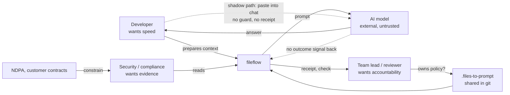

# fileflow as a system: where the gaps are

*2026-10-08. Evidence grades: **Observed** = I ran it and saw it · **Read** = seen in code, not run · **Inferred** = reasoned from the above · **Assumed** = a hypothesis nobody has tested. Nothing here comes from interviewing a user; there have been none.*

## 0. The finding in one paragraph

fileflow produces good evidence (a receipt with a reason for every file left out, a secret scan, provenance) and then **withholds it from the person at the moment they decide**. The receipt was opt-in. The text receipt showed counts, not names. The web page showed nothing. On a realistic messy project the default run sent **≈100,000 tokens, 99.9 % of it one lockfile, said nothing about six files it left out, and warned only about a PNG, using a Python exception name.** The same pattern shows up in every earlier bug (§3): the system reported "fine" without having checked. This pass closed the information gap for the CLI and the web client. Three decisions remain for you (§6).

## 1. The system, not the tool

| Actor | Wants | Pays the cost of | Our evidence they are served |
|---|---|---|---|
| Developer (incl. the solo, ADHD-first user) | a good prompt in seconds | any friction | **Observed:** default run is fast; but gave no feedback on size or omissions until this pass |
| Team lead / reviewer | the same rules for everyone, reviewable | one person's private setup | **Observed (FN-012):** the shared config file was git-ignored, so it was never shared |
| Security / compliance | proof of what left | an incident they did not see | **Observed:** scanner missed URL-embedded passwords (fixed) |
| The model | relevant, bounded context | noise (cost and quality) | **Observed:** 99.9 % lockfile prompt |
| Buyer / leadership | risk reduced without slowing delivery | a tool nobody uses | **Not tested.** No pilots yet. |

**The real competitor is not Repomix; it is copy-paste into a chat window.** It costs zero seconds, has no install, and is what people do when a safe path is slower. *(Inferred; the market research in `production-architecture.md` is secondary-source.)* So every safety feature has a budget: **it must cost the individual about nothing, or it will be bypassed.** That budget drove the design choices below.

## 2. Behavioural reading of what I found

| Principle | What it predicted | What we did |
|---|---|---|
| **Defaults are the product.** Most people run the default and never read `--help`. | An opt-in receipt will rarely be read. (Observed: it only existed behind `--receipt`.) | One line after every *interactive* run: files, tokens, what stayed out, in words. Piped runs unchanged. |
| **Feedback must arrive where the eye is.** | A summary printed before a 1,000-line prompt scrolls out of sight. | Printed **after** the output; tested on a real pseudo-terminal. |
| **Rare signals stay credible** (alert fatigue). | A warning that fires every run gets ignored, and then the real one is missed. | The big-file advisory fires only when one file is ≥ 5,000 tokens **and** ≥ 50 % of the prompt. |
| **Absence is invisible.** Nobody notices a file that is not there. | "Why isn't my file in the prompt?" has no answer in the UI. | A "Left out of the prompt (N)" list with reasons in plain words, from the same data as the receipt. |
| **Prevent, then correct.** | People will type `dist/` or `docs/big.csv` into an ignore field. (Read: only names match.) | Permanent one-line rule under the field, plus a correction when a path is typed. |
| **Make the safe action one step.** | Advice that needs the user to compose a command gets skipped. | "Leave it out" button; reversible; saved to the shared config (verified). |
| **Advice must work.** | Wrong advice destroys trust faster than none. | A test parses the suggested flag out of the message and **runs it**. It caught a real error: my first advice (a path) never worked. |

## 3. The pattern across every bug so far: *a green signal that was never earned*

| Where | What reported "fine" | What was true |
|---|---|---|
| FN-009 | A security test passed | It passed with the protection removed (wrong redirect code) |
| FN-010 | `fetch` printed a success message | It had saved a bot-challenge page, labelled "observed" |
| FN-012 | "Presets live in the repo's config" | The file was git-ignored; the repo never had it |
| FN-013 | Smoke test "rendered the tree" | It asserted only the output; the DOM shim *invented* a tree row; real first screen was empty |
| FN-014 | Default run: silence | 100k tokens, 99.9 % one lockfile, 6 files left out, a password-bearing URL unflagged |
| FN-014 | `--ignore-patterns docs/x.csv` accepted | Silently a no-op: patterns compare names, never paths |
| FN-014 | My own first advice text | Did not work when copy-pasted |

Seven in a few days, found by **using the product as a stranger would, or by mutation testing, never by reading code.** That is the single most reliable discovery method this project has, and the one process rule worth adding to `docs/engineering-contract.md`: *before a release, run the product on a project you did not make and write down what it did not tell you.* The walkthrough script is §7.

## 4. Gap register

**Closed in this pass (all Observed first, then fixed, tested, and mutation-tested):**

| ID | Layer | Gap | Fix | Guarded by |
|---|---|---|---|---|
| G1 | Technology / safety | Scanner blind to credentials in URLs (`postgres://u:pw@host`, Mongo, Redis, git remotes) — the commonest real shape | `url-credentials` rule + npm/GitLab/SendGrid token shapes. Placeholders, `${VAR}`, `%s`, weak defaults, ports, SSH remotes, **Sentry DSNs (public by design)** deliberately not flagged | 26 tests incl. hostile-input timing; 8/8 mutations caught |
| G2 | Human factors | Omissions silent in the default run; receipt opt-in and counts-only | Terminal line after output; plain-word reasons; web "left out" list | 16 + 9 tests; real-pty ordering test; browser audit |
| G3 | Human / cost | One noise file can be ~all of a paid prompt | Advisory (CLI, `ask` before consent, web with one-click fix) | thresholds, executed-advice and escaping tests |
| G4 | Service language | Two vocabularies: `UnicodeDecodeError` vs `BINARY` | One closed vocabulary with a test that every reason has words | test forces wording for new reasons |
| G5 | Interaction | Path-shaped ignore patterns silently do nothing | Warning with the fix (CLI), correction + permanent hint (web), help text now says "NAMES" | tests + browser audit |
| G6 | Interface parity | Web client could not answer "why is X missing?" | `/api/prompt` returns `left_out`, counts, `dominant` (bounded to 300 entries; no absolute paths) | server tests; XSS check on hostile file name |

**Open:**

| ID | Layer | Gap | Evidence | Status |
|---|---|---|---|---|
| G7 | Technology / risk | ~~No default file-size cap~~ | Observed (400 KB passed) · Read (no cap anywhere) | **Closed (FN-015):** 1 MiB default, visible, one documented override; `/api/file` bounded too; a garbage env value no longer crashes the CLI |
| G8 | Defaults | Known-noise files (lockfiles, `*.min.js`, build output not in `.gitignore`) are included by default | Observed | **Your decision (§6-B)**; today we warn, we do not exclude |
| G9 | Safety | Token-only userinfo (`https://<token>@host`) is not flagged | By design (Sentry DSNs); known limit | Accepted; documented in the rule |
| G10 | System loop | **No outcome feedback.** Nothing records whether the AI's answer was useful, so no one can learn which context mattered | Inferred | Needs a pilot; do not build blind |
| G11 | Organisation | Who owns `.files-to-prompt`? No review rule (CODEOWNERS), no drift alert between teammates | Inferred (FN-012 shows the file can silently not be shared) | Test with 3 teams (§7) before building a check |
| G12 | Adoption | Install-to-first-prompt time never measured; the competitor is a paste | Assumed | Measure in the §7 sessions |
| G13 | Environment (Lagos) | Offline-first works; the hosted plane's latency/power/bandwidth assumptions are untested | Assumed | Revisit with pilot network conditions |
| G14 | Interface parity | Web still lacks a preset picker, a downloadable receipt, and provenance labels for imported files (R3) | Observed | Next build if you choose R3 |
| G15 | Quality | No Windows run, no real screen-reader pass, VS Code extension untested, `ask` never run against a live provider | Observed (never run) | Needs a Windows runner, a human, and a key |
| G17 | Safety / interaction | ~~A config that fails to parse warned, then sent anyway; wrong-typed settings were silently dropped~~ | Observed | **Closed (FN-015, decision D applied):** exit 2, nothing sent; `check` lists every problem |
| G18 | Distribution | Nothing is pushed or published: a participant cannot install it | Observed (wheel builds and installs in ≈ 1 s once you have it) | **Blocks the pilot; your decision (§6-E)** |
| G19 | Interaction | Typos in config keys were silent; empty result was silent | Observed | **Closed (FN-015)** |
| G16 | Interaction | The web client joins ignore patterns with commas, so a pattern containing a comma is split in two | Read in code, not run | Low; fix when touched |

## 5. Service blueprint: moments of truth

| Moment | What the person sees | Backstage | Failure observed | Now |
|---|---|---|---|---|
| 1. Install | `pip install` | wheel with web client + fonts | none seen; **time not measured** | G12 |
| 2. First run | a prompt scrolls by | walker, scanner, receipt (built, unseen) | silence; PNG error in Python jargon | **fixed** (line + vocabulary) |
| 3. "What did it send?" | nothing, or `--receipt` counts | receipt JSON has per-file reasons | evidence existed, was withheld | **fixed** (list in web; JSON in CLI) |
| 4. Share with the team | commit `.files-to-prompt` | config validated by `check` | file was git-ignored (FN-012) | fixed + `C_CONFIG_IGNORED` |
| 5. After an incident | "show me what left" | receipts are unsigned, optional | cannot prove anything | ADR-023 (design only) |

## 6. Decisions only you can make

- **A. Default file-size cap?** Today unlimited. Options: *(1)* warn only (current), *(2)* skip files over 1 MiB with a visible reason (`TOO_LARGE` already exists), *(3)* cap at 256 KiB. Risk of (2)/(3): a legitimately large source file disappears — now visible in the list, but still a behaviour change. **My recommendation: (2), announced in release notes.**
- **B. Default-exclude known noise (lockfiles etc.)?** Biggest effect on cost and quality; also silently changes output for existing users, and some people *want* the lockfile (dependency audits). **Recommendation: keep warning only until two pilots say the warning was not enough.**
- **D. Should a config that fails to parse stop the run?** Today `fileflow .` warns and continues, so `secrets.mode = "block"` in a broken file is silently lost. Options: *(1)* keep (current), *(2)* fail closed with `E_CONFIG_PARSE` (exit 2), *(3)* fail closed only when the file mentions `[secrets]`/`block`. **Decided and built (recommendation (2)).** It matches `--preset`, and a user with a broken config wants to know before sending anything. Cost: a stray typo now blocks until fixed; the message already names the line.
- **E. Distribution for the pilot:** hand participants the wheel (works today) or push the branch and publish to TestPyPI (needs your accounts). **Recommendation: wheel for the first two sessions, TestPyPI before the rest.**
- **C. Next build (superseded by the pilot kit; see Step 1 there):** R3 remainder (preset picker, downloadable receipt, provenance in the offline client) or the pilot kit (§7 plus the GitHub Action). **Recommendation: pilot kit first.** Everything above was found by observation; more building without observers repeats the pattern in §3.

## 7. How to learn the rest (no building required)

*(Now packaged as [`docs/pilot-kit/`](pilot-kit/README.md): the walkthrough as a standing test, a session script, a task card, an observation log and success criteria to sign before the first session.)*

**The stranger walkthrough (30 minutes, repeatable).** `scripts/make_demo.py` creates a messy project. Run `fileflow .` as someone who has never seen it. Write down: what did it tell me; what did it *not* tell me that I needed; what would I have done next? Do it again after every release on a repo you did not make.

**Five observation sessions** (engineers at two or three real teams; no demo, their repo):
1. *Task:* "Get an AI to explain this module, without sending anything you wouldn't send." Watch: do they use fileflow or paste? Seconds to first prompt?
2. Do they notice the "left out" line? Can they say what was left out, unprompted? (Falsifies G2's fix if not.)
3. Do they act on the big-file advisory, or dismiss it? (Falsifies the thresholds if everyone dismisses it.)
4. Whose job is `.files-to-prompt`? Who would review a change to it? (G11)
5. Ask what they would be blamed for if a secret leaked. (Tells you who the buyer really is.)

**Success criteria worth committing to before looking:** ≥ 4 of 5 get a prompt faster than their usual paste; ≥ 4 of 5 can name a file that was left out; no participant sends a secret. Anything else is a result, not a failure — but write the criteria down first.
